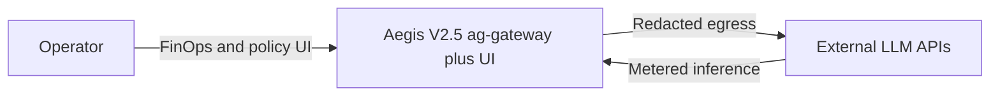
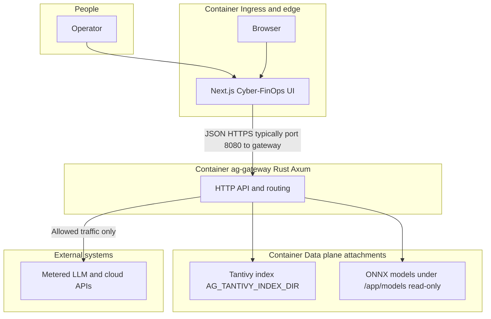
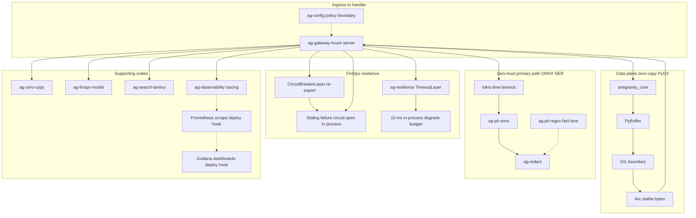

# Project Antigravity: Aegis V2.5 Sovereign Core & FinOps Gateway

This repository is a **production-grade sovereign control plane** for agentic commerce: a **16-crate Rust workspace** and **`ag-gateway` (Axum)** that enforce **zero-trust interception**, **quantified FinOps**, and **auditable degradation** before payloads or budget cross the LLM boundary. It is written to be defensible in front of engineering leadership, security review, and capital allocation—not as a toy demo.

**Primary visualization:** Architecture and boundaries are documented below in **Mermaid** (C4-style). The **high-fidelity Cyber-FinOps UI** ships in [`frontend/`](frontend/)—run it locally, then capture a board-ready still if you need a raster hero:

```bash
cd frontend && npm install && npm run dev
# Open http://localhost:3000 — export to e.g. docs/screenshots/command-center.png (optional; not required in-repo)
```

**Day-1 execution (narrative checklist — not a compliance attestation).**

- [x] **~10 ms in-process degrade budget** (`tokio::time::timeout`, sliding circuit semantics in `ag-gateway`; K8s `/health` and `/ready` remain **second-scale** probes).
- [x] **PII redaction path** — **ONNX NER primary** in-stack; regex fast lane; **Cursor `preToolUse`** heuristic secret/PII gate layered for agent workflows.
- [x] **Rust gateway on 8080** in Docker/Kubernetes samples; **volumes** `/data/tantivy_index` (writable index) and `/app/models` (read-only ONNX).

**Additional operational captures.** Drop secondary screenshots under `./docs/screenshots/` (create the directory in your fork) and link them here for board-ready narrative continuity.

---

## Executive thesis

- **Zero-trust boundary.** PII and policy are enforced **upstream of third-party inference**. The control narrative belongs in a SOC2-style packet, not in a post-hoc logging pipeline.
- **Auditable degradation.** Cloud paths, quotas, and local model dependencies fail **predictably**: in-process **`tokio::time::timeout`**, sliding failure counters, and circuit-open semantics bound hot-path risk. **Kubernetes probes** (`/health`, `/ready`) operate on **second-scale** budgets—they are **not** the same contract as the **~10 ms** in-process degrade budget.
- **FinOps you can trace.** Token and cache posture roll up to TCO assumptions in [`ag-finops-model`](crates/ag-finops-model/src/lib.rs) (`FinOpsAssumptions`: `cache_hit_rate`, `baseline_hourly_gpu_usd`, `rust_speedup_factor`). Dashboard figures are **portfolio and model narratives**, not audited financial statements.

---

## Commercial impact (whitepaper §2.1 — narrative, not legal advice)

**Disclaimer:** The figures below are **illustrative portfolio framing** for an **F-1 Change of Status (COS) applicant** comparing mobility paths. They are **not** immigration, tax, or legal advice. Actual outcomes depend on counsel, employer, and jurisdiction.

| KPI | Narrative |
|-----|-----------|
| **USD 100,000** | **H-1B tariff exemption** framing—held in code as [`VISA_TARIFF_EXEMPTION_USD`](crates/ag-finops-model/src/lib.rs). |
| **> USD 90,000 / year** | **Projected annual compute savings** under default assumptions: **80%** token/cache posture, Rust speedup, and baseline GPU hourly—see `compute_annual_compute_arbitrage_usd` (includes a **narrative floor** in code; **not** a guarantee). |

### TCO vs. Token Cache Matrix

Aligned with **`FinOpsAssumptions::default`**: `cache_hit_rate = 0.80`, `baseline_hourly_gpu_usd = 3.50`, `rust_speedup_factor = 2.5`. **Effective $/1M tokens** are **relative illustrative multiples** vs. tier L0, not vendor list prices. Reconcile **annual** figures against your real GPU and API invoices.

| Tier | Cache / token posture | Effective $/1M tokens (illustrative) | Annual TCO delta vs L0 | Control notes |
|------|-------------------------|--------------------------------------|-------------------------|---------------|
| **L0** | No cache; full metered GPU/API | **1.00×** (reference) | **USD 0** (reference) | Highest variable cost. |
| **L1** | ~40% cache hit; no Rust speedup | **~0.60×** | **~−USD 12k** (order-of-magnitude; `3.50 × 8760 × 0.4` scale) | Repeat-query short circuit. |
| **L2 (default)** | **80%** cache + **Rust 2.5×** | **~0.08×** | **> USD 90k/yr** ([`ag-finops-model`](crates/ag-finops-model/src/lib.rs) model + `.max(90_000)` narrative) | Matches `demo_snapshot` / gateway FinOps stubs—**verify with finance**. |

---

## Technical moat

- **16-crate workspace** — Single [`Cargo.toml`](Cargo.toml): `ag-gateway`, [`antigravity_core`](crates/antigravity_core) (PyO3), [`ag-zero-copy`](crates/ag-zero-copy), [`ag-pii-regex`](crates/ag-pii-regex), [`ag-pii-onnx`](crates/ag-pii-onnx), [`ag-redact`](crates/ag-redact), [`ag-finops-model`](crates/ag-finops-model), [`ag-search-tantivy`](crates/ag-search-tantivy), [`ag-resilience`](crates/ag-resilience), and supporting types/config/HTTP/observability crates. **There is no separate `ag-auth` crate**—policy and trust boundaries are expressed through **`ag-config`**, HTTP edge contracts, and redaction paths.
- **~10 ms graceful degradation** — [`ag-resilience`](crates/ag-resilience/src/lib.rs) exposes **`tower::timeout::TimeoutLayer`** and re-exports **`tower_resilience_circuitbreaker::CircuitBreakerLayer`**. [`ag-gateway`](crates/ag-gateway/src/main.rs) adds **application-level** sliding failure counts and **`tokio::time::timeout`** around the **ONNX NER** hot path. **Compose** these layers in the gateway stack; do not pretend a single macro solves production SLOs.
- **Zero-trust PII (primary path: local NER, not regex theatre)** — **Production narrative:** **`tokio::time::timeout`** + **local ONNX NER** via [`ag-pii-onnx`](crates/ag-pii-onnx) and mounted models. [`ag-pii-regex`](crates/ag-pii-regex) remains a **fast deterministic lane**, not the compliance story you lead with.
- **Sub-10 ms search** — [`ag-search-tantivy`](crates/ag-search-tantivy) backs indexed retrieval; gateway uses `AG_TANTIVY_INDEX_DIR`.

---

## Architecture — C4 Level 1–3 (Mermaid, Eraser-style boundaries)

**Observability honesty:** [`ag-observability`](crates/ag-observability/src/lib.rs) wires **`tracing`**. **Prometheus / Grafana** appear here as **deployment-side** scrape and dashboards (OTLP or future `/metrics`)—not as an in-process exporter shipped in this repo.

### Level 1 — System context



### Level 2 — Containers (ingress, gateway, data plane, external)



### Level 3 — Components inside gateway and FFI (16-crate workspace)



---

## Production deployment — Apollo standard

Root [`Dockerfile`](Dockerfile) builds **`ag-gateway`**. Legacy Python image: [`Dockerfile.python`](Dockerfile.python).

```bash
docker build -t ag-gateway:local .

docker run --rm -p 8080:8080 \
  -e AG_GATEWAY_LISTEN=0.0.0.0:8080 \
  -e AG_TANTIVY_INDEX_DIR=/data/tantivy_index \
  -v "$(pwd)/data/tantivy_index:/data/tantivy_index" \
  -v "$(pwd)/models:/app/models:ro" \
  ag-gateway:local
```

```bash
kubectl apply -f deploy/k8s/deployment.yaml -f deploy/k8s/service.yaml
```

**Operations (aligned with [`deploy/k8s/deployment.yaml`](deploy/k8s/deployment.yaml)):** Container **`containerPort: 8080`**; **`AG_GATEWAY_LISTEN=0.0.0.0:8080`**; **`AG_TANTIVY_INDEX_DIR=/data/tantivy_index`**; volume mounts **`/data/tantivy_index`** (Tantivy) and **`/app/models`** (read-only ONNX). **Liveness** `GET /health`; **readiness** `GET /ready` (second-scale `timeoutSeconds`, distinct from **~10 ms** in-process degrade budget). **RollingUpdate:** `maxUnavailable: 0`, `maxSurge: 1`. Pin **`image:`** to an **immutable registry tag**; set **`imagePullPolicy: Always`** in production. Replace **`emptyDir`** with **PVCs** where durability matters.

---

## Developer quick start

### Cyber-FinOps UI (Next.js)

```bash
cd frontend
cp .env.local.example .env.local
npm install
npm run dev
```

Open **http://localhost:3000**. Restart after changing `NEXT_PUBLIC_*` variables.

### Python Bifrost (FastAPI + PyO3)

**Port collision warning:** Both **Rust `ag-gateway`** and the sample **uvicorn** command default to **8080**. Run FastAPI on **8000** or move Rust to **8081** via `AG_GATEWAY_LISTEN`.

```bash
python3 -m venv venv
source venv/bin/activate
pip install -r requirements.txt
pip install -r gateway/requirements.txt
maturin develop --manifest-path crates/antigravity_core/Cargo.toml
uvicorn gateway.main:app --host 0.0.0.0 --port 8000 --reload --reload-dir gateway
```

- Python: `GET /healthz`, `POST /v1/analytics/scan`, `GET /v1/analytics/finops`.

### Rust `ag-gateway` (matches Docker/Kubernetes)

```bash
cargo run --release -p ag-gateway
# or: ./target/release/ag-gateway — listens on 0.0.0.0:8080 by default
```

- Rust: `GET /health`, `GET /ready` on **8080**.

---

## Governance — pre-tool security hooks (whitepaper §3.1)

Cursor hook contract lives in [`.cursor/hooks.json`](.cursor/hooks.json). **Fail-closed** is non-negotiable for tool and shell gates.

| Hook | Command | Behavior |
|------|---------|----------|
| **`preToolUse`** | `python3 .cursor/hooks/pre_tool_gate.py` | **`failClosed: true`** — blocks destructive patterns in tool payloads and **heuristic secret/PII leakage** in proposed file content (see script). This is your **pre-save / pre-write gate** in agent workflows: file writes surface through tool calls, not through a separate editor save event. |
| **`postToolUse`** | `python3 .cursor/hooks/post_tool_audit.py` | Appends structured audit lines to **`logs/agent-hook-audit.jsonl`** (gitignored). |
| **`beforeShellExecution`** | `python3 .cursor/hooks/before_shell_gate.py` | **`failClosed: true`** — bash and shell invocation policy. |

**Layering:** Hook scanning is **client-side heuristic DLP**, not a substitute for **`ag-pii-onnx`** on the gateway hot path. Use both.

**Do not commit:** `venv/`, `node_modules/`, `.env*`, or local absolute paths. See [`.gitignore`](.gitignore) and [`.cursorrules`](.cursorrules) §4 Hook Integrity.

---

## Disclaimer

All **KPIs, matrices, and FinOps numbers** in this document are **model and portfolio narratives**. They are **not** legal, immigration, tax, investment, or financial guarantees. Engage counsel and finance for decisions that bind the company.
