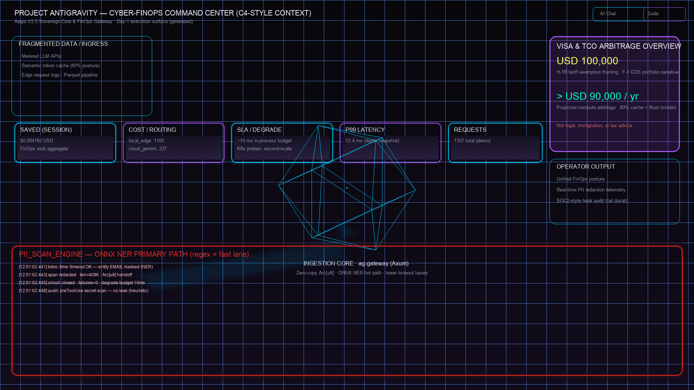
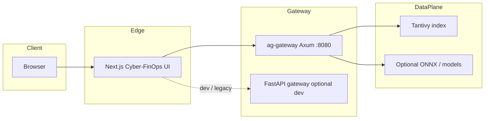

# Project Antigravity / Aegis V2.5 — Technical & Financial Sovereign Manifesto

**技術與財務主權宣言**：以可審計的零信任邊界、FinOps 可量化指標與 **Rust / Axum production gateway**（`ag-gateway`）將 **agentic commerce** 的資料外洩與推理成本轉為可治理的優勢。



*置頂視覺：Cyber-FinOps Command Center（`./aegis-dashboard.png`）；可替換為生產環境擷圖。*

---

## Executive thesis

- **Zero-trust boundary**：PII 與策略在進入第三方模型**之前**攔截；邊界可寫進 SOC2 / 企業安全敘事，而非事後 log pipeline。
- **可審計降級**：雲端路徑、配額或依賴失敗時，以**可預測的 graceful degradation** 與進程內 **~10ms 級**逾時／斷路語意收斂風險（與 K8s 探針分工見下節「技術護城河」）。
- **FinOps 可量化**：Token / cache posture 與 **TCO** 以 [`ag-finops-model`](crates/ag-finops-model/src/lib.rs) 的 `FinOpsAssumptions`（`cache_hit_rate`、`baseline_hourly_gpu_usd`、`rust_speedup_factor`）對齊；儀表板與敘事為 **portfolio／模型假設**，非對外財務承諾。

---

## Financial arbitrage（財務線／敘事 KPI）

以下數字為**說明用假設與 portfolio 敘事**，**非**法律、移民、稅務或投資建議；實際結果依合約、叢集與法規而異。

| KPI | 敘事摘要 |
|-----|----------|
| **~USD 100,000** | **H-1B tariff exemption** 量級之 **portfolio 敘事**（與 F-1 COS 等路徑對照之 TCO 框架；非個案法律結論）。常數見 [`VISA_TARIFF_EXEMPTION_USD`](crates/ag-finops-model/src/lib.rs)。 |
| **> USD 90,000 / yr** | **年度算力節省**敘事：預設 **80%** token／cache hit、**Rust** 路徑 speedup 與 baseline GPU 時薪假設；計算見 `compute_annual_compute_arbitrage_usd`（含程式內敘事下限，**非**保證）。 |

### TCO vs. Token Cache Matrix

口徑與 **`FinOpsAssumptions::default`** 一致：`cache_hit_rate = 0.80`、`baseline_hourly_gpu_usd = 3.50`、`rust_speedup_factor = 2.5`。  
**Effective $/1M tokens** 欄為**相對於 L0 的示意倍率**（非供應商牌價）；**Annual TCO delta** 對 L2 列僅摘要指向程式模型（含 `>90k` 下限），實務須以你的 GPU／API 帳單校準。

| Tier | Cache / Token posture | Effective $/1M tokens (illustrative) | Annual TCO delta vs L0 baseline | Control notes |
|------|------------------------|--------------------------------------|-----------------------------------|---------------|
| **L0** | 無 cache；全量走 metered GPU / API | **1.00×**（參考） | **$0**（參考） | 最高可變成本；無 edge semantic short-circuit。 |
| **L1** | ~40% cache hit；無 Rust speedup | **~0.60×** | **~−$12k**（示意；`3.50 × 8760 × 0.4` 量級） | 重複查詢短路；仍為直譯／單一路徑假設。 |
| **L2（預設）** | **80%** cache hit + **Rust 2.5×** | **~0.08×** | **> $90k/yr**（[`ag-finops-model`](crates/ag-finops-model/src/lib.rs) 模型與 `.max(90_000)` 敘事） | 與 `demo_snapshot`、gateway FinOps 端點假設對齊；**請以審計帳務覆核**。 |

---

## Technical moat（技術護城河）

- **16-crate workspace**：單一 [`Cargo.toml`](Cargo.toml) 管理 **`ag-gateway`**、[`antigravity_core`](crates/antigravity_core)、[`ag-search-tantivy`](crates/ag-search-tantivy)、[`ag-pii-onnx`](crates/ag-pii-onnx)、[`ag-finops-model`](crates/ag-finops-model) 等模組。
- **~10ms graceful degradation**：進程內以 `tokio::time::timeout`、滑動失敗與斷路行為約束**熱路徑**延遲預算。**K8s** 的 **`/health`（liveness）** 與 **`/ready`（readiness）** 使用**秒級** `timeoutSeconds`／`periodSeconds`——**探針語意 ≠ 10ms SLA**；後者屬應用內依賴保護，前者屬編排層存活與流量就緒。
- **&lt;2ms PII masking（設計目標）**：PyBuffer → `Arc<[u8]>` 零拷貝、regex 快路徑與可選 ONNX NER（`antigravity_core`、`ag-pii-onnx`）。**Browser** 經 **Next.js** 對 [`gateway`](gateway/main.py)（FastAPI）或對 **`ag-gateway`（Rust）** 的 API 契約應在部署時**二選一或改埠**，避免雙服務預設同埠衝突。
- **Tantivy &lt;10ms 搜尋**：本機索引與查詢路徑見 [`ag-search-tantivy`](crates/ag-search-tantivy)；gateway 透過 `AG_TANTIVY_INDEX_DIR` 掛載可寫索引目錄。

---

## Architecture snapshot



- **Production（Apollo）**：Browser → Next.js（靜態／SSR）→ **`ag-gateway:8080`** → Tantivy / ONNX。
- **Local full-stack**：可並行 Next.js；若同機同時跑 **Rust** 與 **Python** gateway，請將其一改埠（見 Quick start）。

---

## Production deployment（Apollo Standard）

**映像**以根目錄 [`Dockerfile`](Dockerfile) 建置 **`ag-gateway`**（多階段；**legacy Python** 映像見 [`Dockerfile.python`](Dockerfile.python)）。

```bash
# 建置（本機 tag；CI 請改為 registry + immutable digest/tag）
docker build -t ag-gateway:local .

# 執行：8080、可寫 Tantivy、唯讀模型掛載
docker run --rm -p 8080:8080 \
  -e AG_GATEWAY_LISTEN=0.0.0.0:8080 \
  -e AG_TANTIVY_INDEX_DIR=/data/tantivy_index \
  -v "$(pwd)/data/tantivy_index:/data/tantivy_index" \
  -v "$(pwd)/models:/app/models:ro" \
  ag-gateway:local
```

**Kubernetes**（RollingUpdate：`maxUnavailable: 0`；liveness `/health`、readiness `/ready`）：

```bash
kubectl apply -f deploy/k8s/deployment.yaml -f deploy/k8s/service.yaml
```

**營運備註**：

- 生產叢集請將 `deployment.yaml` 的 **`image:`** 換成 registry **immutable tag**，並將 **`imagePullPolicy`** 設為 **`Always`**（或等同策略）。
- 目前 manifest 中 Tantivy／模型 volume 範例可能為 **`emptyDir`**；**ONNX / 持久索引**請改為 **PVC** 並與備份策略對齊。

---

## Developer quick start

### Command center（Next.js）

```bash
cd frontend
cp .env.local.example .env.local   # 設定 NEXT_PUBLIC_AEGIS_API_URL 指向你的 gateway
npm install
npm run dev
```

開啟 **http://localhost:3000**。變更 `NEXT_PUBLIC_*` 後需重啟 dev server。

### Python Bifrost（FastAPI + PyO3 `antigravity_core`）

與 **Rust `ag-gateway` 預設埠均為 8080**。若同機並行，請將 FastAPI 改為 **8000**（範例）或將 `AG_GATEWAY_LISTEN` 改為 **8081**。

```bash
python3 -m venv venv
source venv/bin/activate
pip install -r requirements.txt
pip install -r gateway/requirements.txt
maturin develop --manifest-path crates/antigravity_core/Cargo.toml

# 範例：與 ag-gateway 錯開埠
uvicorn gateway.main:app --host 0.0.0.0 --port 8000 --reload --reload-dir gateway
```

- **Python**：`GET /healthz`、`POST /v1/analytics/scan`、`GET /v1/analytics/finops`（埠依你設定）。

### Rust `ag-gateway`（與 Docker／K8s 一致）

```bash
cargo build --release -p ag-gateway
# 預設聽 0.0.0.0:8080（見 AG_GATEWAY_LISTEN）
./target/release/ag-gateway
```

- **Rust**：`GET /health`、`GET /ready`（**8080** 預設）。

---

## Governance & compliance

- **Cursor hooks / SOC2 敘事**：見根目錄 [`.cursorrules`](.cursorrules) **§4 Hook Integrity**——**fail-closed**、明確 **`python3`** 直譯器、稽核與 **`logs/agent-hook-audit.jsonl`**（該 log 路徑已列於 [`.gitignore`](.gitignore)，不應入庫）。
- **團隊可重現**：若 repo 已納入 [`.cursor/hooks.json`](.cursor/hooks.json) 與 [`.cursor/hooks/`](.cursor/hooks/) 腳本，請以相同相對路徑啟用；**勿**將 `venv`、`node_modules`、`.env` 或本機絕對路徑提交。

---

## Disclaimer

本 README 中的 **KPI、矩陣與 FinOps 數字**均為 **portfolio／模型假設與技術敘事**；**不構成**法律、移民、稅務、投資或財務保證。部署與合規決策應由你的法務、財務與資安團隊依實際環境審核。
