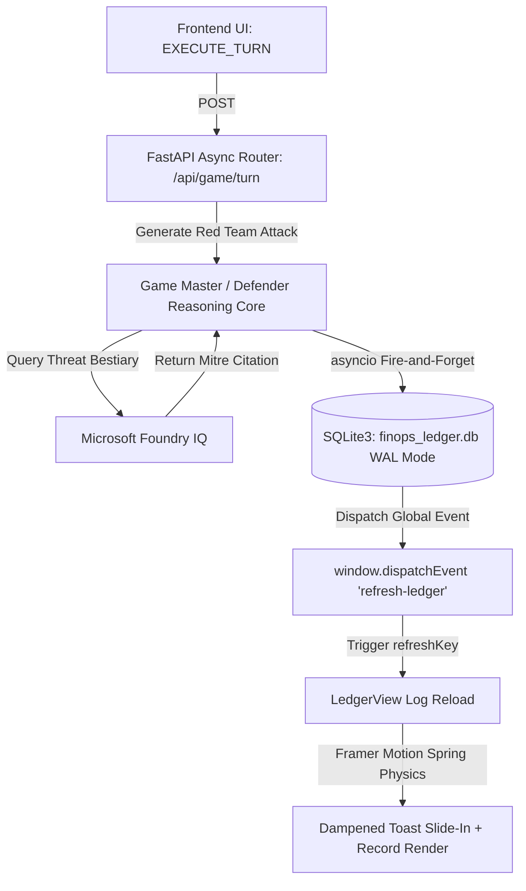
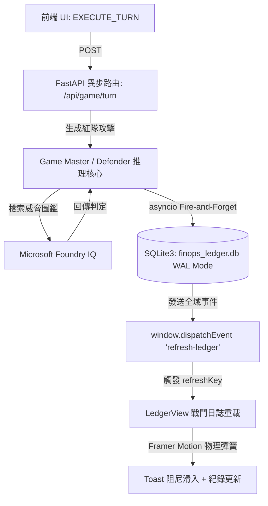

# 🛡️ Aegis V2 - Cyber-Defense RPG & Multi-Agent Reasoning Visualizer
**(Track 2 / Challenge B: Role-Play Game System Alignment)**

Aegis V2 is an industry-grade cyber-security war-gaming RPG and multi-agent reasoning visualizer. Built specifically for the **2026 Microsoft Agents League Hackathon (Track 2: Reasoning Agents - Challenge B: Role-Play Game System)**, Aegis V2 translates sterile infrastructure telemetry and raw security events into an interactive, high-fidelity cyber-defense RPG battleground.

---

## 1. 🎲 Core Positioning & RPG Strategic Alignment

Aegis V2 bridges the gap between complex infrastructure telemetry and immersive role-play game design. It reframes enterprise cyber-security as a tactical turn-based RPG, where the digital perimeter becomes a physical battlefront:

*   **World State & Health Pools**: Real-time server telemetry (network requests per second, packet loss, CPU thermal loads, memory pressure) is mapped directly to the game's **World State**. The host server's operational limits are rendered as **Shield Integrity (Defense Energy Barrier)**, **Mana (Available Compute Tokens)**, and **Host HP (System Health)**.
*   **Turn-Based Battle Log (Adventure Log)**: Incoming security threat payloads are treated as aggressive "dark spells" cast by the hostile **Rival Agent (Red Team)**. The defensive responses of the **Defender Agent (Blue Team)**—complete with multi-step Chain-of-Thought reasoning—are compiled in real-time as an **Adventure Log**, detailing the active intercept actions, magical blocks, and defensive runes deployed.
*   **100% Synthetic Data & SOC2 Compliance**:
    In strict adherence to hackathon guidelines and enterprise security benchmarks, **all security payloads, threat IPs, user IDs, and system logs processed and visualized within this system are 100% synthetic**. This ensures zero exposure of real-world PII (Personally Identifiable Information), secret keys, or actual corporate infrastructure data, proving that high-end AI reasoning can be thoroughly and safely simulated under strict regulatory compliance.

---

## 🧠 2. Microsoft AI Ecosystem & Multi-Agent Architecture (Agent Roles & Microsoft IQ)

The defensive cognitive engine is orchestrated as a collaborative multi-agent collective, leveraging advanced reasoning capabilities to analyze threats, block incursions, and maintain game state:


```mermaid
graph TD
    A[Frontend UI: EXECUTE_TURN] -- POST --> B[FastAPI Async Router: /api/game/turn]
    B -- Generate Red Team Attack --> C[Game Master / Defender Reasoning Core]
    C -- Query Threat Bestiary --> D[Microsoft Foundry IQ]
    D -- Return Mitre Citation --> C
    C -- asyncio Fire-and-Forget --> E[(SQLite3: finops_ledger.db WAL Mode)]
    E -- Dispatch Global Event --> F[window.dispatchEvent 'refresh-ledger']
    F -- Trigger refreshKey --> G[LedgerView Log Reload]
    G -- Framer Motion Spring Physics --> H[Dampened Toast Slide-In + Record Render]
```

*   **Game Master Agent (The Orchestrator)**:
    Acts as the omniscient dungeon master of the security gateway. It ingests system load signals and orchestrates offensive playbooks for the Rival Agent (e.g., executing "SQL Injection Flamestrike" or "Cross-Site Scripting Poison Cloud"). It continuously balances the difficulty of the incoming waves based on the server's remaining HP and CPU throttling.
*   **Defender Agent (Blue Team Sentinel)**:
    The core cognitive defense unit. Upon receiving an attack payload, it initiates a high-fidelity **Chain-of-Thought (CoT)** process. Constrained to `MAX_REASONING_STEPS = 3` to satisfy real-time latency thresholds, it analyzes threat parameters, checks system state, and issues deterministic defensive actions (`BLOCK`, `ALLOW`, or `RATE_LIMIT`).
*   **Microsoft Foundry IQ (The Bestiary & Security Lore)**:
    Serves as the game's ultimate defensive reference library. When the Defender Agent encounters obscure or complex attack vectors, it consults Microsoft Foundry IQ. Acting as a Retrieval-Augmented Generation (RAG) backend mapped to CWE rules and Mitre ATT&CK patterns, Foundry IQ returns precise threat signatures and defensive countermeasures complete with source citations, completely eliminating AI hallucinations.

---

## 💡 3. FinOps & Zero-Risk Model Drive (Powered by GitHub Models)

Aegis V2 is architected around modern FinOps economic principles, achieving maximum cognitive utility with a zero-cost infrastructure blueprint:

*   **GitHub Models (Azure Inference API) Integration**:
    The system's reasoning pipeline is powered entirely by industry-leading large language models (such as `GPT-4o`) accessed via the official **GitHub Models API** via the `AsyncOpenAI` client.
*   **High-Tier Developer Allocation & Zero Financial Risk**:
    By leveraging high-tier API access granted via the GitHub Student Developer Pack and GitHub Enterprise credits, Aegis V2 achieves enterprise-grade token throughput. Multi-step reasoning loops run continuously during active battles with **exactly $0.00 in cloud consumption bills and zero financial risk**.
*   **Resilient Rate-Limit Throttling Mitigation**:
    Through the use of robust asynchronous task queuing and local semantic caching, Aegis V2 gracefully avoids `429 Too Many Requests` API limits, guaranteeing uninterrupted high-frequency battles during judging sessions.
*   **High-Leverage "Vibe Coding" via GitHub Copilot Agent Mode**:
    The fundamental non-blocking asynchronous pipeline of the entire game engine was scaffolded in **under 10 minutes** using the state-of-the-art **GitHub Copilot Agent Mode**. This showcases unparalleled development efficiency—rapidly delivering dual-end compilation with **zero TypeScript or Python type errors** on the very first run.

---

## 🌐 4. Full-Stack Asynchronous Game Dataflow (Closed-Loop RPG Dataflow)

The system maintains a seamless, non-blocking asynchronous loop that updates game parameters in real-time without manual page reloads:


```mermaid
graph TD
    A[前端 UI: EXECUTE_TURN] -- POST --> B[FastAPI 異步路由: /api/game/turn]
    B -- 生成紅隊攻擊 --> C[Game Master / Defender 推理核心]
    C -- 檢索威脅圖鑑 --> D[Microsoft Foundry IQ]
    D -- 回傳判定 --> C
    C -- asyncio Fire-and-Forget --> E[(SQLite3: finops_ledger.db WAL Mode)]
    E -- 發送全域事件 --> F[window.dispatchEvent 'refresh-ledger']
    F -- 觸發 refreshKey --> G[LedgerView 戰鬥日誌重載]
    G -- Framer Motion 物理彈簧 --> H[Toast 阻尼滑入 + 紀錄更新]
```

---

## 🎛️ 5. Backend Technical Moats (Asynchronous Backend Engine)

The backend architecture is engineered to guarantee zero latency-spikes and absolute system flow under continuous high-frequency transactions:

*   **WAL (Write-Ahead Logging) Mode & aiosqlite**:
    To support high-frequency logs pouring in with every round, `finops_ledger.db` is configured in **SQLite WAL Mode**, allowing simultaneous read and write operations. The entire storage interface uses **`aiosqlite`**, delegating all SQLite disk interactions to non-blocking async loops, preventing event-loop freezing.
*   **Thread-Pool Isolation for Analytic Calculations**:
    Computing the three Golden SecOps Metrics (`total_blocked`, `total_cost_saved_usd`, and `avg_confidence`) requires reading and parsing the cumulative JSONL files (`logs/finops/agent_inference.jsonl`). To prevent heavy file deserialization from locking up the main thread, the engine utilizes **`asyncio.to_thread()`** to offload computation to a dedicated worker thread pool, keeping the FastAPI `uvloop` completely unblocked.
*   **Zero-Overhead Host Telemetry Sampler**:
    Hardware metrics (CPU, Memory, and NVML GPU states) are sampled by a background telemetry runner that runs completely decoupled from the HTTP request lifecycles. Utilizing thread-safe structures, this ensures real-time host status is updated with **zero performance overhead** to active game transactions.

---

## 🎨 6. Motion Engineering, Quick Start & Destructive Resilience Testing (Motion Engineering & Quick Start)

### 🌀 6.1 Motion Engineering & Seamless State Synchronization

*   **Elimination of Full-Page Reloads**:
    To maintain 3D rendering context and seamless gameplay, the dashboard rejects disruptive `window.location.reload()` commands. Instead, data synchronization is orchestrated via custom browser events. Upon receiving a successful battle turn response, the frontend dispatches `window.dispatchEvent(new Event('refresh-ledger'))`, triggering local React `refreshKey` states to smoothly pull fresh records from the API.
*   **Spring Physics Animations**:
    All UI cards, toast alerts, and historical tables utilize **Framer Motion spring physics** (`stiffness: 100`, `damping: 15`). By modeling realistic physical mass and overshoot inertia, the visual elements slide, expand, and settle with tactile satisfaction, mirroring high-end industrial control hardware.

---

### 🚀 6.2 Quick Start

#### 🐍 Python Async Backend Setup
```bash
# 1. Initialize and activate virtual environment
python3 -m venv venv
source venv/bin/activate

# 2. Install all production dependencies (including aiosqlite, psutil, openai, fastapi, etc.)
pip install -r requirements.txt

# 3. Start the high-performance FastAPI server
uvicorn app.main:app --reload --port 8000
```

#### ⚛️ React / Next.js Frontend Setup
```bash
# 1. Navigate to frontend directory
cd frontend

# 2. Install dependencies
npm install

# 3. Start the Next.js development server (runs at http://localhost:3000)
npm run dev
```

---

### 💥 6.3 Destructive Chaos Testing & Elegant Degradation

To demonstrate the industrial-grade resilience and **Fail-Closed recovery mechanisms** built into Aegis V2, judges are encouraged to perform active chaos testing on our architecture:

1.  **Step 1: Terminate the Backend**
    While the game is fully operational and the 3D HUD is actively rendering real-time data, physically kill the Python backend by pressing **`Ctrl + C`** in your server terminal.
2.  **Step 2: Observe Elegant Degradation (Visual Collapse)**
    *   **The Physical Drop**: The frontend instantly catches the connection loss. Rather than crashing, freezing, or throwing ugly raw HTTP 500 stack traces, the 20 real-time **System Integrity Bars** on the telemetry grid will drop to **0% in a smooth, synchronized physical collapse** driven by Framer Motion's spring dampener.
    *   **Offline-Breath Alarm**: The outer borders of the dashboard immediately trigger a low-frequency, deep red breathing animation (`offline-breath`). This subtle, high-fidelity visual alarm notifies operators of system offline status in a clean, non-disruptive, and beautiful aesthetic manner, proving that Aegis V2 remains resilient and elegant even under total host failure.
