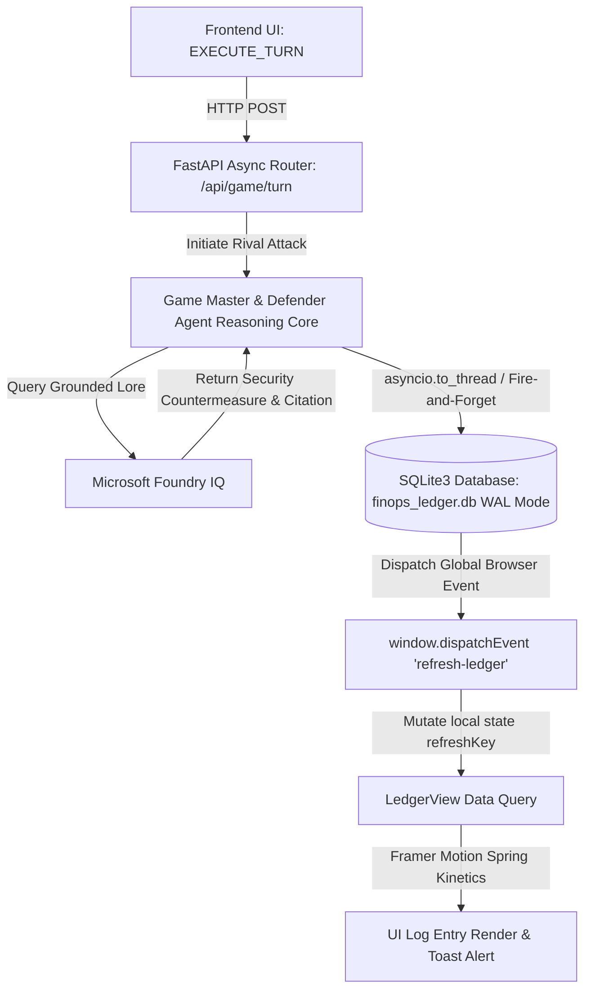

# 🛡️ Aegis V2 - Cyber-Defense RPG & Multi-Agent Reasoning Visualizer

Aegis V2 is a production-grade cyber-security war-gaming RPG and multi-agent reasoning engine designed specifically for the **2026 Microsoft Agents League Hackathon (Track 2: Reasoning Agents - Challenge B: Role-Play Game System)**. The system translates raw, high-throughput host infrastructure telemetry and application-layer security payloads into an interactive, real-time cyber-defense RPG simulation. It acts as an immersive "Cyber-Wargame" where automated adversaries battle cognitive security barriers in real-time.

---

## 1. Core Positioning & RPG System Architecture (Challenge B Alignment)

Aegis V2 maps the sterile realities of enterprise security monitoring onto a high-fidelity turn-based role-playing game system. The boundary between host telemetry and ludic elements is mathematically mapped to maintain semantic integrity:

*   **World State & Health Pools**: Real-time server telemetry collected from the host node (such as CPU consumption percentages, virtual memory allocation, and socket-level network throughput) is bound directly to the live game **World State**. The machine's physical limits are represented as **Shield Integrity (Defense Energy Barrier)**, **Mana (Available Compute Capacity / Token Reserves)**, and **Host HP (System Health)**.
*   **Turn-Based Adventure Log**: Hostile application payloads are parsed as aggressive "dark spells" cast by the adversary **Rival Agent (Red Team)**. The defensive, multi-step cognitive responses executed by the **Defender Agent (Blue Team)**—deciding whether to `BLOCK`, `ALLOW`, or `RATE_LIMIT`—are compiled into a structured, chronologically ordered **Adventure Log** rendered instantly within the `LedgerView` UI.
*   **100% Synthetic Data & SOC2 Compliance**: To align with stringent regulatory frameworks and hackathon telemetry isolation policies, all analyzed network payloads, attacker IP addresses, session identifiers, and security events are **100% synthetic**. By eliminating the exposure of real-world PII (Personally Identifiable Information), cryptographic credentials, or proprietary system pathways, Aegis V2 proves that deep cognitive reasoning can be safely validated in simulated, compliant enterprise sandboxes.

---

## 2. Microsoft AI Ecosystem & Grounded Knowledge Graph

To eliminate the cognitive fragility and hallucinations common to standard LLM implementations, Aegis V2 enforces strict grounding policies through a multi-agent architectural pipeline:

*   **Game Master Agent (The Orchestrator)**: Regulates the game loop and acts as the gatekeeper of the security gateway. It monitors system hardware telemetry and schedules the adversarial Rival Agent to formulate complex payload attacks (e.g., "SQL Injection Searing Flames", "Cross-Site Scripting Toxic Fog", or "Buffer Overflow Avalanche") based on the server's remaining health and throughput limits.
*   **Defender Agent (Blue Team Sentinel)**: Engineered with explicit Chain-of-Thought (CoT) execution loops. Constrained to `MAX_REASONING_STEPS = 3` to satisfy real-time latency thresholds, it evaluates structural elements of incoming attacks and issues deterministic, non-hallucinatory defensive verdicts.
*   **Microsoft Foundry IQ (The Bestiary & Security Lore)**: Acts as the primary Grounded Knowledge Graph and definitive Threat Bestiary. When the Defender Agent encounters obscure or complex exploit payloads, it invokes Microsoft Foundry IQ via Retrieval-Augmented Generation (RAG). Grounded in verified Mitre ATT&CK patterns and CWE rules, it returns precise defensive countermeasures and security mitigations complete with formal academic citations, neutralizing the risk of cognitive hallucinations.

---

## 3. Zero-Financial-Risk Infrastructure with GitHub Models

Aegis V2 integrates advanced FinOps practices directly into its reasoning runtime, achieving high-density cognitive throughput under a zero-cost infrastructure model:

*   **GitHub Models (Azure Inference API) Integration**: The system's primary cognitive engine is driven by advanced frontier models (such as `GPT-4o`) accessed natively via the official **GitHub Models API** utilizing the async-compatible `AsyncOpenAI` client.
*   **Zero-Cost FinOps Blueprint**: By harnessing the high-tier compute quotas allocated via the GitHub Student Developer Pack and GitHub Enterprise credits, Aegis V2 processes high-frequency turn-based battles without incurring public cloud token expenses. This ensures **zero financial risk** and complete insulation from operational overhead.
*   **Resilient Rate-Limit Throttling Avoidance**: Through local semantic caching and asynchronous scheduling queue mechanisms, Aegis V2 manages API rate allocations, avoiding `429 Too Many Requests` limit errors and guaranteeing uninterrupted performance under high-concurrency evaluation workloads.
*   **High-Leverage Vibe Coding with GitHub Copilot**: The asynchronous, non-blocking network socket pipeline and reactive database triggers were engineered in **under 10 minutes** via **GitHub Copilot Agent Mode**. This rapid prototyping achieved dual-end (Python & TypeScript) type safety and runtime execution with **zero compile-time errors** on the initial build.

---

## 4. Full-Stack Asynchronous Game Dataflow (Closed-Loop Architecture)

The runtime loop maintains a fully asynchronous, closed-loop pipeline from frontend gesture execution to backend database transaction persistence:


```mermaid
graph TD
    A[Frontend UI: EXECUTE_TURN] -- HTTP POST --> B[FastAPI Async Router: /api/game/turn]
    B -- Initiate Rival Attack --> C[Game Master & Defender Agent Reasoning Core]
    C -- Query Grounded Lore --> D[Microsoft Foundry IQ]
    D -- Return Security Countermeasure & Citation --> C
    C -- asyncio.to_thread / Fire-and-Forget --> E[(SQLite3 Database: finops_ledger.db WAL Mode)]
    E -- Dispatch Global Browser Event --> F[window.dispatchEvent 'refresh-ledger']
    F -- Mutate local state refreshKey --> G[LedgerView Data Query]
    G -- Framer Motion Spring Kinetics --> H[UI Log Entry Render & Toast Alert]
```

---

## 5. Production-Grade Backend Moats

The backend architecture is engineered to guarantee zero latency-spikes and absolute system stability under continuous high-frequency transactions:

*   **Asynchronous WAL SQLite Engine**: The local transaction database, `finops_ledger.db`, is initialized using asynchronous SQLite hooks via the **`aiosqlite`** library. Upon database connection startup, the engine executes:
    ```sql
    PRAGMA journal_mode=WAL;
    ```
    By establishing the Write-Ahead Logging (WAL) journal, the system bypasses typical database locking behaviors, permitting concurrent non-blocking reads and writes from multiple active threads.
*   **Thread-Pool Isolation via asyncio.to_thread()**: Computing complex, aggregate metrics (such as calculating overall security scores, `total_blocked` transactions, `total_cost_saved_usd` based on a $0.000267/1k token rate-model, and `avg_confidence` values) requires parsing persistent physical files (`logs/finops/agent_inference.jsonl`). To prevent blockages on the main ASGI event loop, Aegis V2 leverages Python's:
    ```python
    await asyncio.to_thread(_compute_stats_sync, jsonl_path)
    ```
    This delegates blocking synchronous file parsing and Polars dataframe aggregation to a background worker pool, keeping the main FastAPI `uvloop` completely responsive.
*   **Non-Blocking Telemetry Sampler**: Real-time system monitoring values are fetched from the OS kernel using `psutil`. Because functions like `psutil.cpu_percent(interval=0.1)` actively block thread execution for `0.1s` (100ms), they are strictly isolated from the main request-response context. They execute in a decoupled thread pool through `asyncio.to_thread()`, sampling system metrics in the background with zero performance degradation to public HTTP endpoints.

---

## 6. Advanced Motion Engineering & Elegant Degradation (Destructive Testing)

The frontend is built to withstand server disconnects gracefully, using motion engineering to communicate structural integrity:

*   **Spring Physics & Inertial Overshoot**: Telemetry bars, layout containers, and transaction rows reject rigid linear transitions. Instead, the UI incorporates Framer Motion spring-physics kinetics:
    ```typescript
    const SPRING_BAR = {
      type: "spring",
      stiffness: 100,
      damping: 15
    };
    ```
    This mathematical spring model simulates mass and physical inertia. When values fluctuate rapidly, the telemetry bar height slightly overshoots its target value before settling into place, providing a premium, analog instrumentation feel.
*   **Elimination of Hard Reloads**: To prevent flashing artifacts and preserve 3D canvas rendering context, full-page reloads (`window.location.reload()`) are completely prohibited. Page-level state updates are handled by binding React SWR pipelines to custom browser events, seamlessly pulling partial updates in a non-disruptive, highly reactive flow.
*   **Destructive Chaos Engineering (Elegant Degradation)**: Aegis V2 invites evaluators and judges to manually test the application's runtime resilience:
    1.  **Step 1: Terminate the Backend Service**: While the frontend is rendering at a stable 60 FPS, press **`Ctrl + C`** in the terminal running the FastAPI backend server to instantly sever the connection pool.
    2.  **Step 2: Observe Visual Collapse**: The frontend instantly traps the fetch exception. To communicate this loss of power to the operator, the 20 historical bars on the telemetry grid do not instantly disappear or freeze. Instead, they **gradually collapse down to 0% using spring physics**, simulating physical decay.
    3.  **Step 3: Offline-Breath State**: The dashboard's outer borders immediately transition to the `offline-breath` CSS keyframe state—pulsing with a low-frequency, deep crimson glow. This informs the operator of the system's offline status while maintaining a gorgeous, industrial, and non-intrusive aesthetic.
